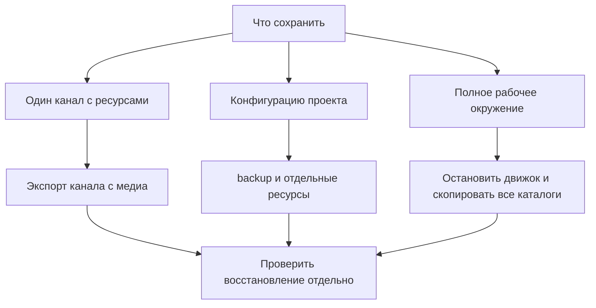

# Как выбрать резервную копию

```mermaid
flowchart TD
    A[Что сохранить] --> B[Один канал с ресурсами]
    A --> C[Конфигурацию проекта]
    A --> D[Полное рабочее окружение]
    B --> E[Экспорт канала с медиа]
    C --> F[backup и отдельные ресурсы]
    D --> G[Остановить движок и скопировать все каталоги]
    E --> H[Проверить восстановление отдельно]
    F --> H
    G --> H
```

[Состав данных](../data-and-backup.md) · [Как восстановить](../guides/backup-restore.md) · [Главная](../index.md)
